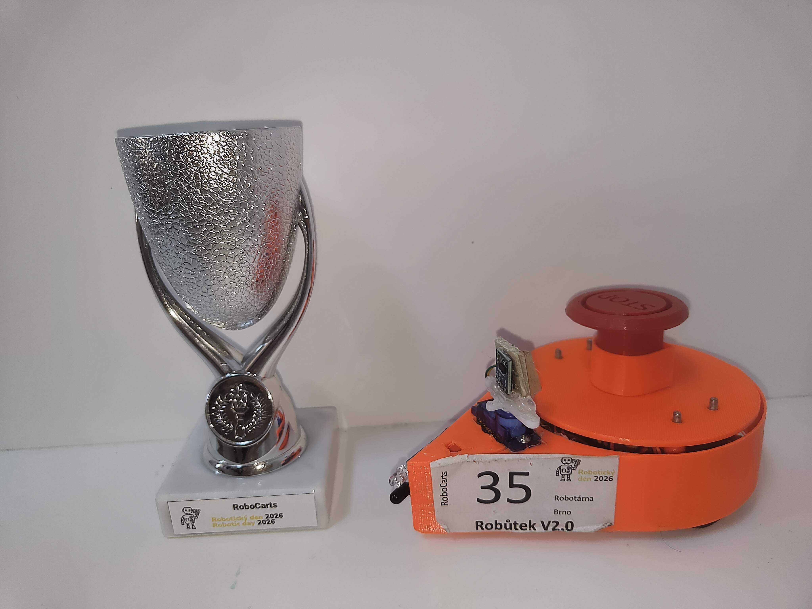
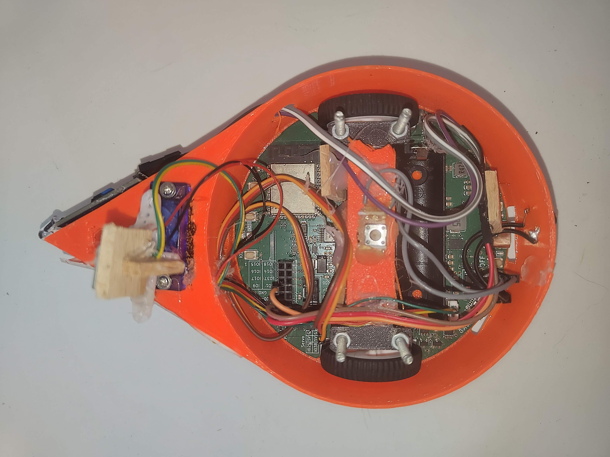
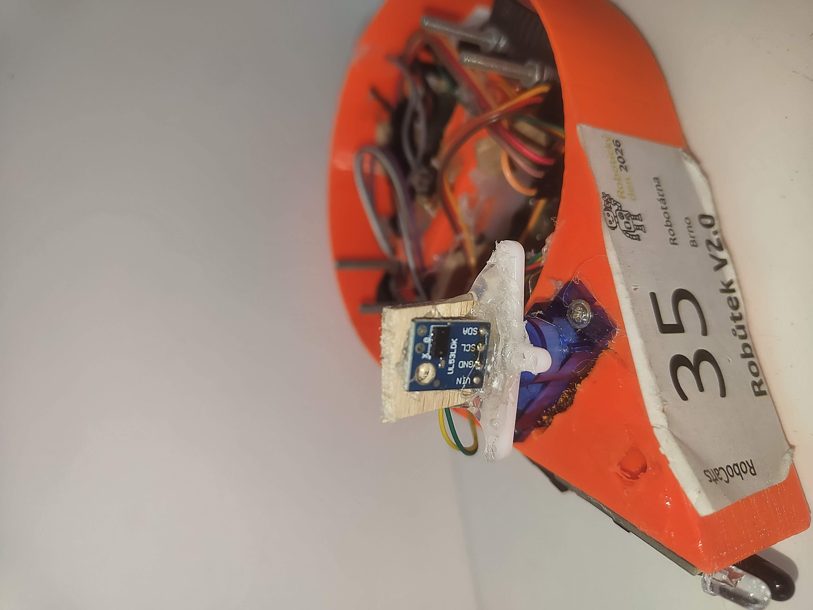

# Robůtek V2.0 - RoboCarts Competitor

This repository contains the source code and documentation for **Robůtek V2.0** (Robot #35), which won **2nd place** in the **RoboCarts** category at **Robotic Day 2026** in Prague. 🥈

The robot is built upon the open-source hardware platform from Robotárna Brno, featuring custom obstacle avoidance logic, track navigation sequencing, and a dynamic telemetry status indication using an addressable RGB LED strip.

## Upstream Project
This robot is based on the official platform designed by Robotárna Brno. You can find the original project specification, core hardware documentation, and schematics at:
👉 [robutek.robotikabrno.cz/v2/](https://robutek.robotikabrno.cz/v2/)

---

## Gallery & Hardware Overview

Below are the reference images of the platform located in the `/images/` directory:

### 1. Hero Shot & Trophy

*File: `/images/00.jpg`* The final assembled Robůtek V2.0 showcasing the 3D-printed orange chassis alongside the silver 2nd place RoboCarts trophy. The mandatory large red emergency STOP button is mounted prominently on top.

### 2. Internal Component Layout

*File: `/images/01.jpg`* A top-down view inside the chassis showing the dense integration of the ESP32-based development board, Li-ion battery, motor drivers, and cable management.

### 3. Sensor Assembly & Field Engineering

*File: `/images/02.jpg`* A detailed close-up of the VL53L0X Time-of-Flight (ToF) laser distance sensor. It is mounted directly onto a micro steering servo via a custom birch plywood adapter and hot glue, allowing active scanning/calibration.

---

## Technical Specifications

- **Microcontroller:** ESP32 (running an asynchronous TypeScript/JavaScript engine)
- **Primary Sensor:** VL53L0X Time-of-Flight (ToF) distance sensor (connected via I2C at 400kHz)
- **Actuators:** High-speed DC micro-gearmotors + steering micro-servo
- **Indicators:** 7-pixel WS2812B addressable SmartLed strip

## Key Software Features

- **Asynchronous Flow Control:** Uses modern `async/await` syntax for efficient, non-blocking hardware polling and simultaneous execution of background routines (such as the LED rainbow animation effect).
- **Proportional Steering Control:** Implements a localized P-regulator logic loop to adjust the `steering` angle based on real-time distance variations while moving along walls.
- **Dynamic Threat Assessment:** Compares time deltas (`dt`) and distance steps to calculate closing velocity, allowing the robot to automatically detect and stop for oncoming or slower obstacles before resuming its hardcoded track sequence.

